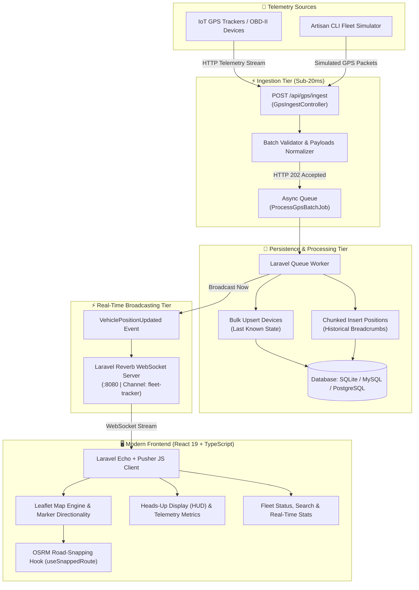

# 🛰️ Fleet Tracker — Real-Time IoT GPS Telematics & Fleet Monitoring Platform

[](https://laravel.com)
[](https://react.dev)
[](https://www.typescriptlang.org)
[](https://tailwindcss.com)
[](https://vitejs.dev)
[](https://laravel.com/docs/reverb)
[](https://creativecommons.org/licenses/by-nc/4.0/)

> **Evaluation Notice:** Technical assessment submission for evaluation purposes only. All architectural designs, queue pipelines, and frontend implementations are the intellectual property of the author.  
> Commercial use, reproduction, distribution, or deployment of this source code (in whole or in part) without explicit written authorization is strictly prohibited under **CC-BY-NC 4.0**.

---

## 📌 Executive Summary

**Fleet Tracker** is an enterprise-grade IoT telematics and real-time fleet intelligence platform engineered for high-throughput GPS ingestion, low-latency asynchronous processing, and reactive geospatial visualization. 

Designed to process continuous telemetry streams from physical GPS hardware (Teltonika, Queclink, Suntech, or mobile OBD-II units), the architecture decouples ingest HTTP endpoints from database persistence via asynchronous queues, broadcasting live vehicle coordinates and diagnostics over **Laravel Reverb** WebSockets to a **React 19 / Leaflet** mission control dashboard.

---

## 🏗️ System Architecture



---

## 🚀 Key Architectural Features

### 1. High-Throughput Asynchronous Ingestion
- **Immediate Response Time (<20ms):** The `POST /api/gps/ingest` endpoint accepts payloads (single JSON object or batch array) and immediately offloads processing to `ProcessGpsBatchJob`, returning an `HTTP 202 Accepted` response to avoid keeping IoT sockets open.
- **Dot-Notation Normalization:** Flexible key flattener supporting nested dot-notation (`position.latitude`, `engine.ignition.status`) as well as snake_case telemetry payloads standard across cellular telematics protocols.
- **Resilient Retry & Backoff:** Configured with 3 retry attempts and exponential backoff (`[5s, 15s, 30s]`) to guarantee zero data loss during high database load.

### 2. High-Performance Bulk Persistence
- **State Upsert (`devices`):** Consolidates vehicle state into a single query via `Device::upsert()`, updating real-time metrics (`last_latitude`, `last_longitude`, `last_speed`, `last_direction`, `engine_ignition`, `movement_status`, `mileage`, `last_seen_at`).
- **Chunked Historical Ingestion (`gps_positions`):** Ingests historical GPS breadcrumbs in 500-record chunks to prevent SQL parameter limits while preserving full trajectory history.

### 3. Real-Time WebSocket Telemetry (Laravel Reverb)
- **Zero-Latency Push:** Broadcasts updates over the `fleet-tracker` public channel with event name `position.updated`.
- **Fault-Tolerant Isolation:** Broadcasting is wrapped in best-effort exception isolation so temporary WebSocket downtime never blocks database ingestion or queue execution.

### 4. Interactive Mission-Control Dashboard (React 19 + Vite)
- **Leaflet Vector Mapping:** Dark-themed UI with custom vehicle markers, real-time directional heading arrows, and status pulse animations (Moving, Idle, Offline).
- **Intelligent Road Snapping (`useSnappedRoute`):** Integrates the Open Source Routing Machine (OSRM) map-matching API to snap raw GPS coordinates to actual road geometries, featuring in-memory LRU caching, uniform downsampling, and debounce handling.
- **Interactive Telemetry HUD:** Floating glassmorphic HUD showing instant vehicle diagnostics:
  - 🏎️ Speed gauge & movement status
  - 🧭 Compass bearing with cardinal heading names
  - 🏔️ Altitude & Odometer mileage counters
  - 🔋 Battery & external power voltage levels
  - 📶 Cellular GSM signal bar indicator
  - 🔑 Ignition status & instantaneous coordinates (with 1-click clipboard copy)
- **Historical Trajectory Replay:** Trajectory view with directional arrows, route start/end pins, and precise distance computation.
- **Camera Memory:** Non-intrusive pan & zoom handling that preserves the operator's active view while streaming real-time coordinate updates.

---

## 📁 Repository Structure

```
├── backend/                       # Laravel 11+ Telematics Backend
│   ├── app/
│   │   ├── Console/Commands/      # Artisan CLI Commands (FleetSimulateCommand)
│   │   ├── Events/                # Real-Time WebSocket Events (VehiclePositionUpdated)
│   │   ├── Http/Controllers/Api/  # GpsIngestController, DeviceController
│   │   ├── Jobs/                  # ProcessGpsBatchJob (Async Queue Pipeline)
│   │   └── Models/                # Device & GpsPosition Eloquent Models
│   ├── config/                    # reverb.php, database.php, queue.php
│   ├── database/migrations/       # Database Schema Definitions
│   ├── routes/api.php             # REST API Ingestion and Query Endpoints
│   └── tests/                     # Unit and Feature Test Suites
│
├── frontend/                      # React 19 + TypeScript + Vite Dashboard
│   ├── src/
│   │   ├── components/            # Header, Sidebar, MapArea, TelemetryHud, VehicleCard
│   │   ├── hooks/                 # useSnappedRoute (OSRM road-matching hook)
│   │   ├── utils/                 # geo.ts (bearing, distance, Leaflet icons)
│   │   ├── echo.ts                # Laravel Echo / Reverb WebSocket client
│   │   ├── types.ts               # Telemetry and Device TypeScript interfaces
│   │   └── App.tsx                # Main Dashboard Controller
│   └── package.json
│
├── LICENSE                        # CC-BY-NC 4.0 License with Evaluation Notice
└── README.md                      # Monorepo Documentation
```

---

## 📡 API Reference

### 1. Ingest GPS Telemetry
```http
POST /api/gps/ingest
Content-Type: application/json
```

#### Request Payload (Single Record or Array of Records)
```json
[
  {
    "ident": "111110000000001",
    "device_name": "Heavy Truck Alpha",
    "timestamp": 1728151200,
    "position.latitude": 33.5892,
    "position.longitude": -7.6185,
    "position.speed": 74.2,
    "position.direction": 185,
    "position.altitude": 42.0,
    "engine.ignition.status": true,
    "movement.status": true,
    "vehicle.mileage": 15420.8,
    "battery.voltage": 24.6,
    "gsm.signal.level": 92
  }
]
```

#### Response (`202 Accepted`)
```json
{
  "status": "queued",
  "count": 1
}
```

---

### 2. List Fleet Devices
```http
GET /api/devices?active_minutes=30
```

#### Response (`200 OK`)
```json
{
  "data": [
    {
      "id": 1,
      "ident": "111110000000001",
      "name": "Heavy Truck Alpha",
      "last_latitude": 33.5892,
      "last_longitude": -7.6185,
      "last_speed": 74.2,
      "last_direction": 185,
      "engine_ignition": true,
      "movement_status": true,
      "mileage": 15420.8,
      "last_seen_at": "2026-10-05T18:00:00.000000Z"
    }
  ]
}
```

---

### 3. Device Trajectory History
```http
GET /api/devices/{ident}/history?limit=150
```

#### Response (`200 OK`)
```json
{
  "device": {
    "id": 1,
    "ident": "111110000000001",
    "name": "Heavy Truck Alpha"
  },
  "data": [
    {
      "id": 1045,
      "latitude": 33.5880,
      "longitude": -7.6190,
      "speed": 70.0,
      "direction": 180,
      "altitude": 41.5,
      "engine_ignition": true,
      "movement_status": true,
      "recorded_at": "2026-10-05T17:58:30.000000Z"
    }
  ]
}
```

---

## 🎮 Built-in Telemetry Simulator

The platform includes a CLI simulation engine to emulate realistic vehicle physics, drift, speed, and heading variations without needing physical hardware:

```bash
cd backend
php artisan fleet:simulate --interval=2 --vehicles=3
```

**Options:**
- `--interval=N` : Frequency in seconds between telemetry transmissions (default: `2`)
- `--vehicles=N` : Number of concurrent simulated vehicles (default: `3`)
- `--url=URL`    : Target ingestion URL (default: `http://127.0.0.1:8000/api/gps/ingest`)

---

## 🛠️ Installation & Setup Guide

### Prerequisites
- **PHP:** 8.2 or higher
- **Composer:** 2.x
- **Node.js:** 18.x or 20.x+
- **Database:** SQLite (default for development), MySQL 8+, or PostgreSQL

---

### 1. Backend Setup (Laravel)

```bash
# Navigate to backend directory
cd backend

# Install PHP dependencies
composer install

# Environment configuration
cp .env.example .env
php artisan key:generate

# Execute database migrations
php artisan migrate

# Start Laravel Reverb WebSocket Server (Terminal 1)
php artisan reverb:start --port=8080

# Start Asynchronous Queue Worker (Terminal 2)
php artisan queue:work --tries=3

# Start Application HTTP Server (Terminal 3)
php artisan serve --port=8000
```

---

### 2. Frontend Setup (React + Vite)

```bash
# Navigate to frontend directory
cd frontend

# Install Node dependencies
npm install

# Configure environment
cp .env.example .env

# Launch Vite Development Server
npm run dev
```

Open your browser at `http://localhost:5173` to access the Fleet Tracker Mission Control Dashboard.

---

### 3. Run Live Simulation

In a new terminal window:
```bash
cd backend
php artisan fleet:simulate --interval=2 --vehicles=3
```
Watch the vehicles animate on the map in real time with continuous WebSocket position broadcasts!

---

## 🧪 Testing & Code Quality

```bash
# Run backend test suite
cd backend
php artisan test

# Run frontend type-check & lint
cd frontend
npm run lint
npm run build
```

---

## ⚖️ License & Evaluation Terms

**CC-BY-NC 4.0 (Creative Commons Non-Commercial)**  
Copyright (c) 2026. All rights reserved.

This repository is provided strictly for recruitment and technical assessment evaluation purposes. Commercial use, reproduction, distribution, or deployment of this source code (in whole or in part) without explicit written authorization is strictly prohibited.

> **Note:** Technical assessment submission for evaluation purposes only. All architectural designs, queue pipelines, and frontend implementations are the intellectual property of the author.
